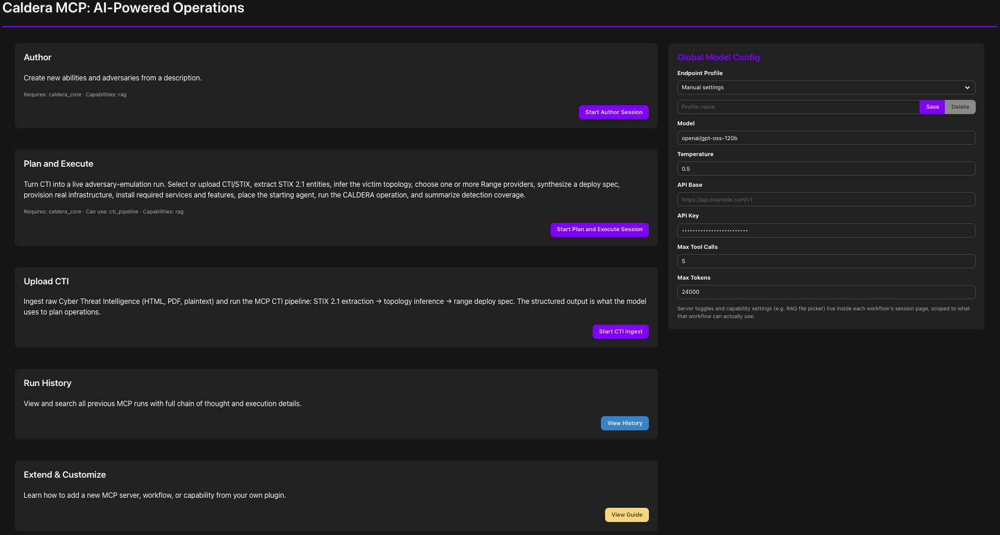
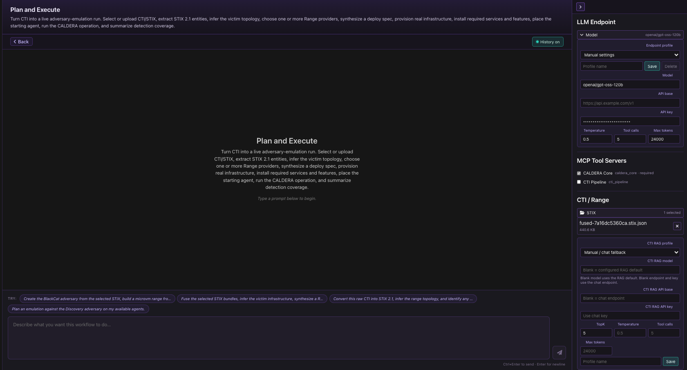
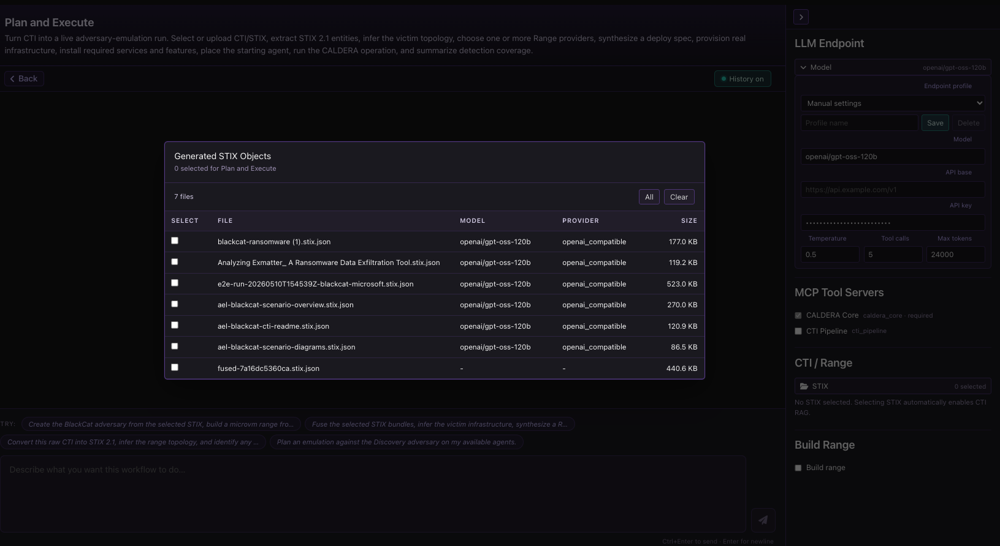
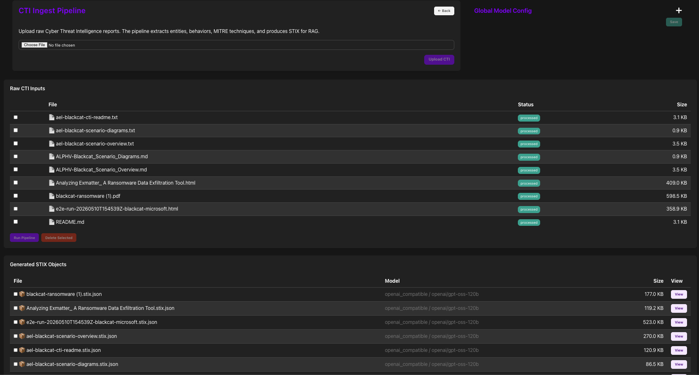

# Caldera MCP Plugin

CALDERA MCP adds an AI-assisted operations workspace to CALDERA. It gives operators chat-based workflows for creating adversary content, ingesting CTI, selecting generated STIX, planning adversary-emulation runs, and coordinating Range infrastructure when the Range plugin is available.

The plugin is designed to keep the LLM grounded in MCP tools and server-side context instead of asking the operator to manually stitch together CTI, CALDERA state, Range inventory, and operation planning details.

<p align="center">
  
</p>

<br>

<p align="center"><em>Main MCP workspace with workflow cards and global model configuration.</em></p>

<br>

## Features

- **Author workflow**: Create CALDERA abilities and adversaries from an operator prompt while using available MCP server tools.
- **Plan and Execute workflow**: Select or upload CTI/STIX, infer victim topology, choose one or more Range providers, synthesize a deploy spec, provision real infrastructure, place the starting agent, run the CALDERA operation, and summarize detection coverage.
- **CTI ingest pipeline**: Upload raw CTI in HTML, PDF, plaintext, or Markdown and produce STIX 2.1 bundles for retrieval and planning.
- **STIX selection for planning**: Pick generated STIX bundles from the Plan and Execute workspace. Selecting STIX automatically enables CTI retrieval for that run.
- **Range-aware planning**: Discover loaded Range providers, images, profiles, and features so deploy specs use available infrastructure instead of invented hosts or services.
- **Model and CTI/RAG profiles**: Configure the chat model, API base, API key, temperature, token budget, and tool-call budget. CTI/RAG can use the chat model by default or a saved profile when it needs a different endpoint.
- **MCP server discovery**: Expose CALDERA core tools and optional plugin servers, including the CTI pipeline when installed.
- **Run history and transcripts**: Keep chat sessions, tool calls, reasoning summaries, and final artifacts available for review.

## Recent Changes

### Plan and Execute Workspace

Plan and Execute now has a dedicated workspace for CTI-driven adversary emulation. The workflow keeps its prompt context centralized, shows the LLM endpoint controls in the session, and separates CTI/RAG selection from Range build options.

<p align="center">
  
</p>

<br>

<p align="center"><em>Plan and Execute workspace with LLM endpoint, CTI/RAG, and Range controls.</em></p>

<br>

### STIX Selection Modal

The Plan and Execute CTI picker is now a graphical modal that lists generated STIX bundles with model, provider, and size metadata. The selected bundles are summarized under the CTI / Range section in the workflow sidebar.

<p align="center">
  
</p>

<br>

<p align="center"><em>Graphical STIX selection modal used by Plan and Execute.</em></p>

<br>

### CTI Ingest Pipeline

The CTI ingest workflow stages raw CTI files, runs extraction, and displays generated STIX bundles for later use by RAG-enabled workflows. The generated STIX output is what Plan and Execute uses to infer topology and deployment requirements.

<p align="center">
  
</p>

<br>

<p align="center"><em>CTI ingest pipeline for raw reports and generated STIX bundles.</em></p>

<br>

### CTI Pipeline Fidelity

The CTI pipeline now extracts more deployable structure from STIX and related observables, including infrastructure objects, network-traffic services, software inventory, identities, user accounts, ATT&CK platform hints, CVE references, and operator-review gaps. The goal is to improve deploy-spec fidelity without relying on static, hardcoded host or service lists.

### Range Integration

Plan and Execute reads available Range providers and feature inventory when the Range plugin is present. Generated deploy specs can register Range profiles before deployment so LLM-generated profile names do not fail provider validation.

## Installation

Install MCP like a standard CALDERA plugin.

1. Clone or copy this repository into the CALDERA plugin directory:

```bash
git clone https://gitlab.mitre.org/caldera/caldera-mcp.git plugins/mcp
```

2. Add `mcp` to your CALDERA plugin list in `conf/local.yml`. Keep local configuration in `conf/local.yml`; do not commit that file.

```yaml
plugins:
  - magma
  - sandcat
  - stockpile
  - mcp
```

3. Optional integrations can be enabled by adding their plugins as well:

```yaml
plugins:
  - magma
  - sandcat
  - stockpile
  - range
  - detections
  - mcp
```

4. Install plugin requirements from the CALDERA virtual environment:

```bash
source venv/bin/activate
pip install -r plugins/mcp/requirements.txt
```

5. Configure model credentials through the UI or environment/local config. Avoid committing secrets.

## Quick Start

1. Start CALDERA from the repository root:

```bash
source venv/bin/activate
python server.py --insecure --log=DEBUG
```

2. If MCP UI code changed, start CALDERA with the build flag so Magma rebuilds plugin UI assets:

```bash
source venv/bin/activate
python server.py --insecure --log=DEBUG --build
```

3. Open CALDERA in the browser and select **mcp** from the sidebar.

4. In **Global Model Config**, choose or create an endpoint profile. The default model field is `openai/gpt-oss-120b`; set API base, API key, temperature, tool-call budget, and token budget for your environment.

5. Use **Upload CTI** to ingest raw reports and generate STIX, or start **Plan and Execute** and select existing STIX bundles from the CTI / Range sidebar.

6. For Plan and Execute, select the Range provider or providers you want to use. If no CTI is selected, the workflow runs without CTI retrieval. If STIX is selected, CTI retrieval is enabled automatically.

## Workflow Guide

### Author

Use Author when you want CALDERA content from a natural-language request. The workflow can call available MCP tools to create or update abilities and adversaries.

### Upload CTI

Use Upload CTI to stage raw reports, run CTI extraction, and produce STIX 2.1 bundles. Generated bundles are stored by the plugin and can be selected later from Plan and Execute.

### Plan and Execute

Use Plan and Execute for CTI-driven operations. The workflow can:

- Read selected STIX bundles and CTI/RAG context.
- Infer hosts, operating systems, domains, users, services, and topology.
- Query Range inventory for available providers, images, profiles, and features.
- Synthesize a deploy spec that uses real Range capability.
- Provision infrastructure when requested.
- Place the selected CALDERA agent on the starting host.
- Build and run the CALDERA operation.
- Summarize operator-review gaps and detection coverage.

The workflow should report missing evidence rather than inventing hosts, users, domains, or services.

## Configuration

### Model Profiles

MCP supports saved endpoint profiles in the UI. Profiles can carry:

- Model name
- API base
- API key
- Temperature
- Maximum tool calls
- Maximum tokens

CTI/RAG model settings can use the chat endpoint by default or a separate saved profile when CTI extraction benefits from a different model.

### Local Settings

Use `conf/local.yml` or environment variables for local values. Keep `conf/default.yml` limited to safe defaults.

Common values include:

```yaml
mcp:
  llm:
    model: openai/gpt-oss-120b
    api_base: https://api.example.com/v1
    api_key: ''
    temperature: 0.5
    max_tool_calls: 5
    max_tokens: 24000
```

Environment variables can also be used by deployments that prefer not to store secrets in YAML.

## API Surface

The plugin exposes MCP workflow APIs through CALDERA's aiohttp server. The UI uses those APIs to:

- Start workflow sessions.
- Send chat prompts.
- List MCP servers and tools.
- Save and load endpoint profiles.
- Upload raw CTI.
- List generated STIX bundles.
- Run CTI pipeline steps.
- Read run history and transcripts.

When adding new UI functionality, prefer extending the existing MCP API routes instead of creating separate side channels.

## Project Structure

```text
plugins/mcp/
+-- app/
|   +-- mcp_api.py                 # aiohttp routes used by the UI
|   +-- mcp_svc.py                 # service orchestration
|   +-- mcp_server.py              # MCP server and tool registration
|   +-- mcp_factory_client.py      # Author workflow client
|   +-- plan_execute.py            # Plan and Execute workflow client
|   +-- rag.py                     # STIX retrieval support
|   +-- utilities/
|       +-- cti_deploy_spec.py     # topology and deploy-spec synthesis
|       +-- cti_ingest.py          # raw CTI extraction helpers
+-- conf/
|   +-- default.yml                # safe defaults only
+-- docs/
|   +-- images/                    # README screenshots
+-- gui/views/
|   +-- mcp.vue                    # landing page
|   +-- cti_ingest.vue             # CTI ingest workflow
|   +-- chat/                      # chat workflow components
+-- prompt_context/                # centralized workflow prompt context
+-- requirements.txt
+-- hook.py                        # plugin initialization
```

## Development

Run tests from the plugin repository when available:

```bash
pytest
```

Useful CALDERA startup commands from the CALDERA root:

```bash
source venv/bin/activate
python server.py --insecure --log=DEBUG
python server.py --insecure --log=DEBUG --build
```

Use `--build` after changing Vue, CSS, or other Magma-loaded UI assets.

## Troubleshooting

- **MCP page does not appear**: Confirm `mcp` is listed in `conf/local.yml` and restart CALDERA.
- **UI changes are missing**: Restart with `--build` so Magma rebuilds plugin UI bundles.
- **Model calls fail**: Check the endpoint profile, API base, API key, and model name. The API base often needs a `/v1` suffix for OpenAI-compatible servers.
- **CTI/RAG does not run**: Select at least one generated STIX bundle in Plan and Execute. CTI selection automatically enables RAG for that workflow.
- **Range options are empty**: Confirm the Range plugin is installed, enabled, and reachable by CALDERA. Plan and Execute only lists providers and images that Range reports as available.
- **Deploy spec has review gaps**: The CTI did not provide enough grounded evidence. Add richer CTI, select more STIX bundles, or review the gaps before deployment.

## License

This plugin follows the licensing terms of the CALDERA project and its plugin ecosystem.
